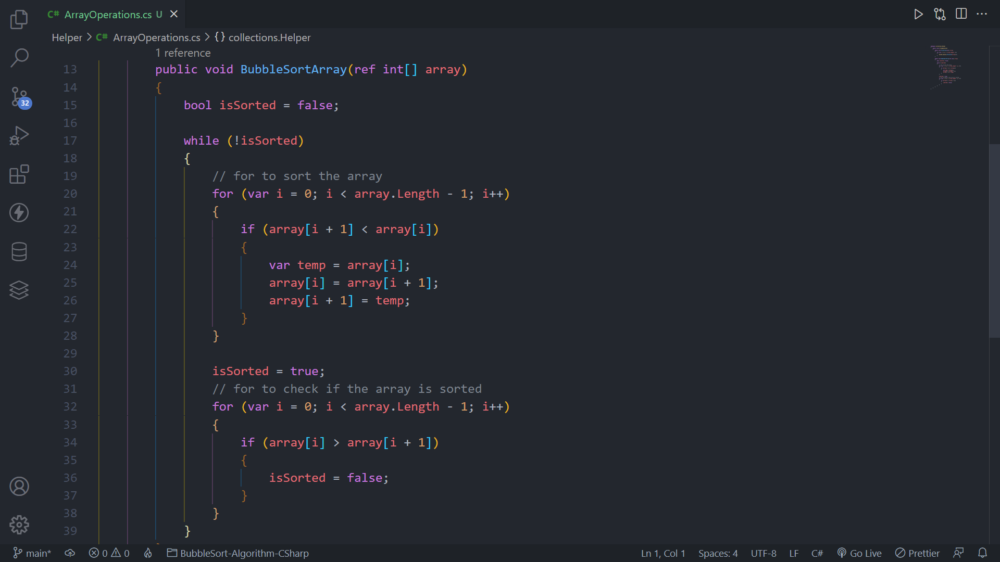

# A simple BubbleSort algorithm using C#

## Overview

### Screenshot

## My proccess

### Built with

-   C#
-   .NET 6.0

### What i learned

In this project i could implement the BubbleSort algorithm to sort an array of integer numbers, using a for loop and a while loop.

## Author

-   GitHub - Vinícius dos Santos Verissimo (https://github.com/viniciusdsv93)
