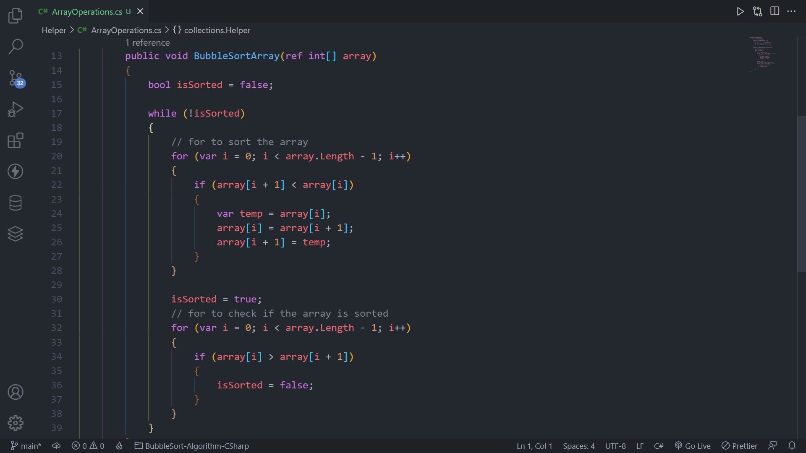

# Algoritmo simples de ordenação BubbleSort utilizando C#

## Visão Geral

### Screenshot

## Meu processo

### Construído com

-   C#
-   .NET 6.0

### O que aprendi

Neste projeto eu pude implementar o algoritmo de ordenação BubbleSort para ordenar um array de números inteiros, usando um ciclo for e um ciclo while.

## Autor

-   GitHub - Vinícius dos Santos Verissimo (https://github.com/viniciusdsv93)
